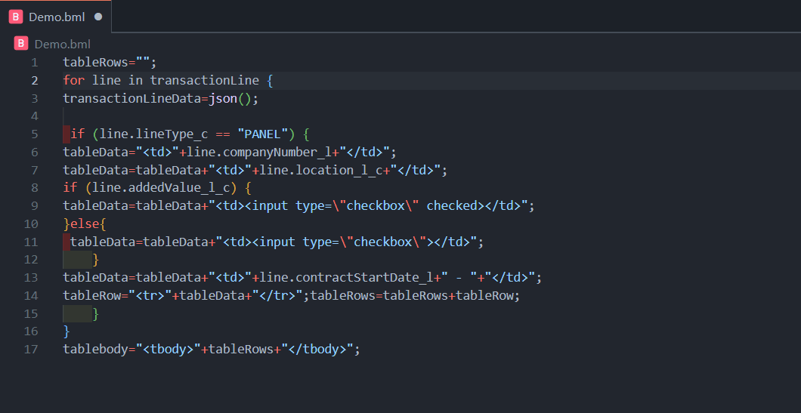
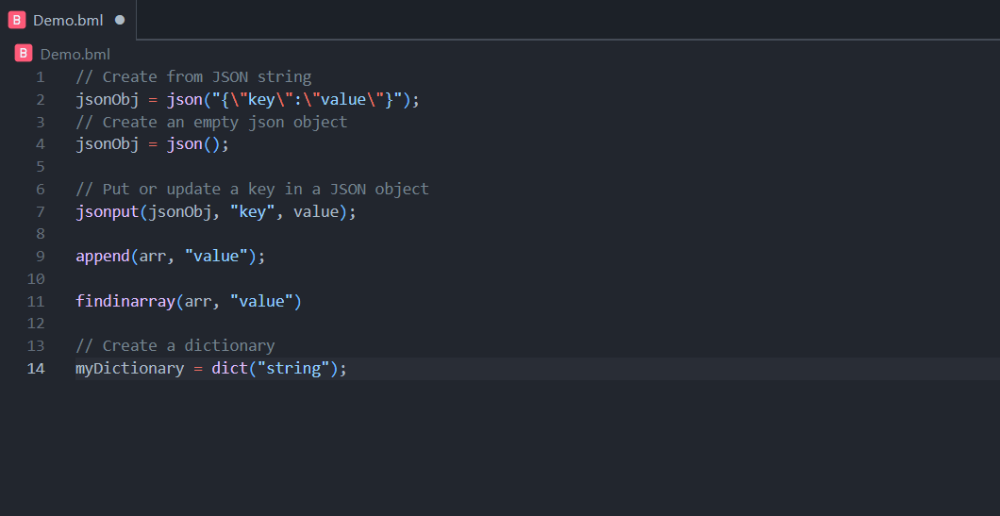

# Developer Tools for CPQ  

A collection of productivity tools for Oracle CPQ developers — including **BML code snippets, formatter, syntax highlighting, documentation explorer, built-in themes, and inline hover help** — all in one extension.  

---

## ✨ Features  

- 🚀 **Snippets for BML functions**  
  - Covers core functions (`json`, `dictionary`, `date`, `string`, etc.)  
  - Quick code patterns for **control structures** (`if/elif`, loops, array handling)  

- 🔍 **BML Docs Explorer (Sidebar)**  
  - Searchable list of functions with **signatures + descriptions**  
  - 📋 **Copy** or ➕ **Insert** snippets directly into the editor  
  - Organized by category for faster lookup  

- 🧹 **Formatter for `.bml` code**
  - Auto-indents multi-line snippets with your **VS Code indentation settings**  
  - Cleans up inconsistent spacing for readable, production-ready BML  

- 🖱️ **Hover Help**  
  - Hover over a BML function → see **signature and description instantly**  
  - Eliminates constant context-switching to Oracle docs  

- 🎨 **Built-in Color Themes**  
  - Includes popular **dark and light themes** (Monokai, Nord, GitHub Dark Dimmed, Notepad++-like, etc.)  
  - Optimized for CPQ developers who spend all day in BML  

- 🖍️ **Syntax highlighting** for `.bml` files (based on Java grammar)  

- 📦 Works in `.bml`, `.txt`, `.c`, `.java` files (so you can draft anywhere)  

---

## 📸 Demo (GIFs)  

### 🔍 Sidebar Docs Explorer  
Search, copy, and insert snippets with one click.  
<!--    -->

### 🧹 Code Formatter  
Keep your BML code clean, consistent, and properly indented.  
<!--    -->

### 🖱️ Hover Help  
See function signatures and descriptions instantly.  
<!--    -->

### 🎨 Themes  
Switch between popular dark/light themes without extra installs.  
<!--    -->

---

## 🚀 Usage  

1. Open a `.bml` file.  
2. Use snippets via autocomplete (`bml-json`, `bml-date-addmonths`, etc.).  
3. Format your code with `Shift+Alt+F` (or right-click → Format Document).  
4. Open the **CPQ Docs Explorer** sidebar (from Activity Bar) to search snippets.  
   - 📋 **Copy snippet** → copies to clipboard  
   - ➕ **Insert snippet** → inserts at cursor, respecting indentation  
5. Hover on a BML function → see **signature + description** instantly.  

---

## ⚙️ Commands & Settings  

- `Format Document` → formats `.bml` code with CPQ-aware rules.  
- `Developer Tools for CPQ: Open Docs Explorer` → open sidebar manually.  
- Uses your **VS Code settings** for indentation (tabs vs spaces).  

---

## 🎨 Themes Included  

- Monokai Pro  
- Solarized Dark / Light  
- Dracula  
- Nord  
- GitHub Dark Dimmed / Light  
- Ayu Mirage / Light  
- Quiet Light  
- Bluloco Light  
- Notepad++ Inspired  

---

## 🛠️ Installation  

1. Install from [VS Code Marketplace](https://marketplace.visualstudio.com/).  
2. Reload VS Code.  
3. Start coding faster in CPQ 🚀.  

---

## 🙌 Contributing  

Issues, feature requests, and PRs are welcome!  

---

